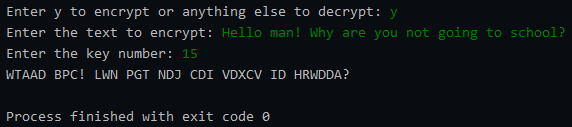
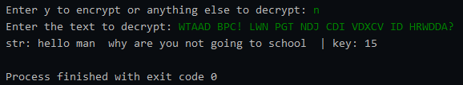

# Caesar-Cipher-Encrypter-Decrypter

  

The Caesar cipher is a simple encryption algorithm that involves shifting each letter of a message by a fixed number of positions in the alphabet. For example, if the encryption key is 3, the letter 'A' would be replaced by 'D', 'B' would be replaced by 'E', and so on.

This program takes a message as input and encrypts it using a specified numerical key between 1 and 25. The encrypted message is known as the cipher text. To decrypt the cipher text, this program also finds the encryption key used and reverses the encryption process.

Here's an overview of how your program works:

- The user enters a message to be encrypted.
- The user enters a numerical key between 1 and 25.
- The program encrypts the message using the key by shifting each letter of the message by the specified number of positions in the alphabet. The resulting encrypted message is the cipher text.
- The program outputs the cipher text to the user.
- The user can also choose to decrypt the cipher text.
- The program outputs the plain text and the key used to encrypt.

Overall, this provides a simple and fun way to experiment with encryption and decryption, and to learn about how encryption algorithms work. It's a great starting point for exploring more advanced encryption algorithms and their applications in real-world scenarios.

## Disclaimer
This Decrypter works only for strictly english words present in US_eng Dictionary. This fails for checking any proper nouns or words of any other languages.

## Share Code as notes
https://gist.github.com/4f21137ec76cc61f3b35638a49d0d73e.git